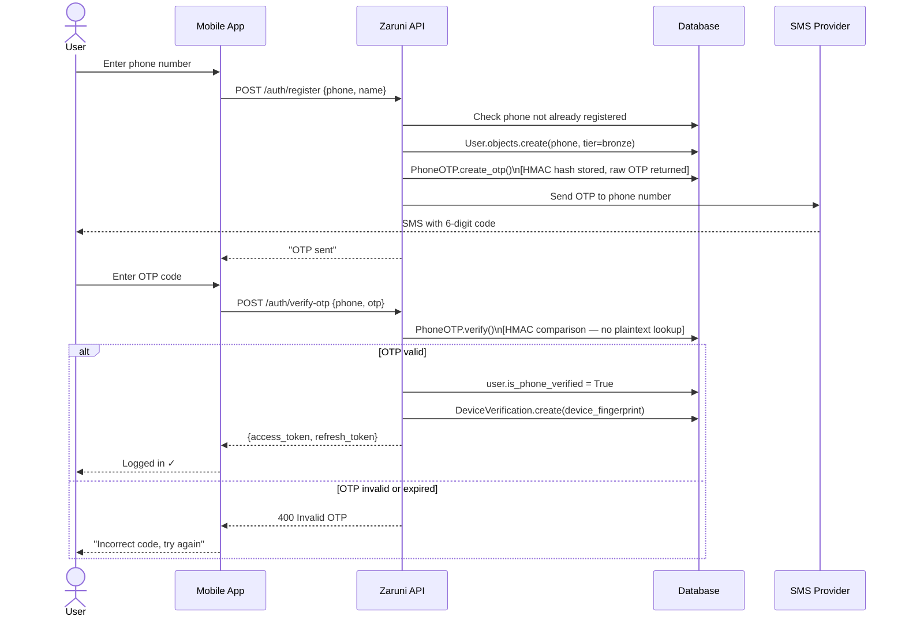
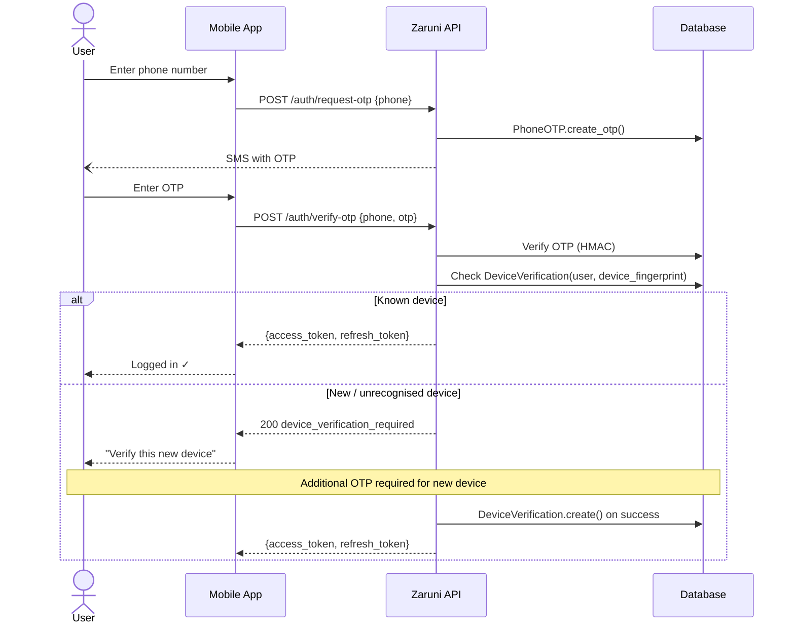
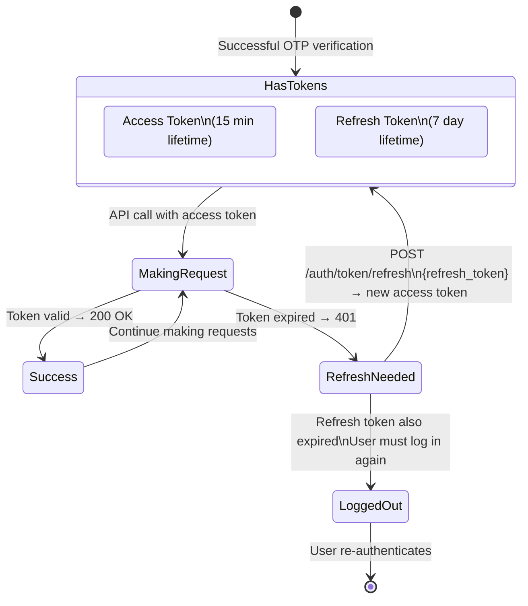
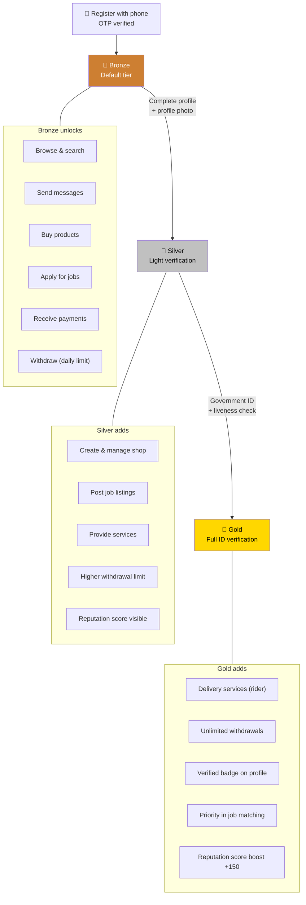
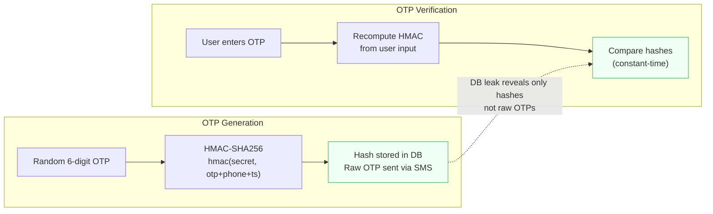

# Authentication Flow Diagrams

> Registration, login, JWT lifecycle, and device verification.

---

## Registration & OTP Verification

---

## Login Flow (Returning User)

---

## JWT Token Lifecycle

---

## Verification Tier Progression

---

## OTP Security Model

No plaintext OTPs ever written to the database. An attacker with database access cannot recover valid OTPs.

---

*Source: [architecture/auth-architecture.md](auth-architecture.md) · [case-studies/2025-verification-tiers.md](../case-studies/2025-verification-tiers.md)*
