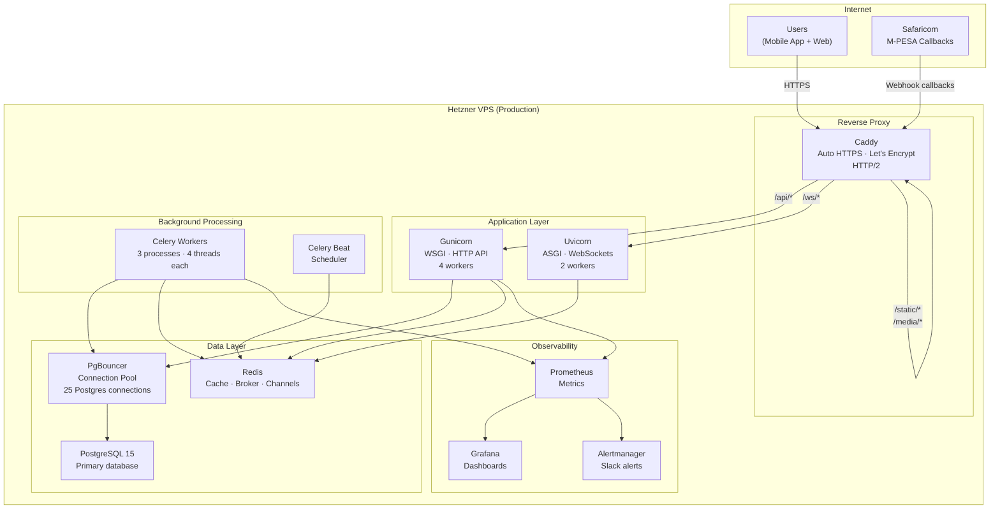
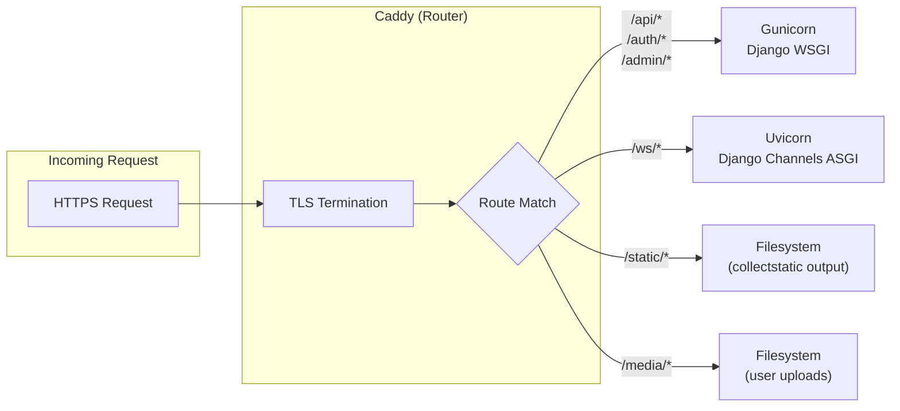
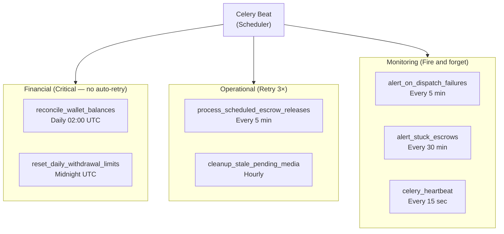
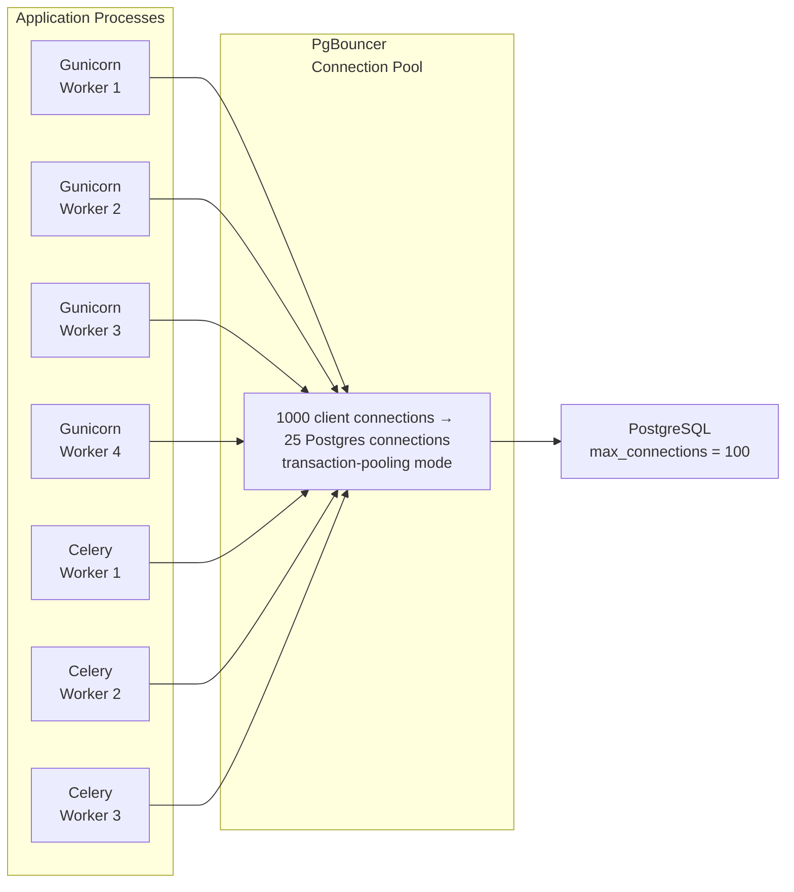
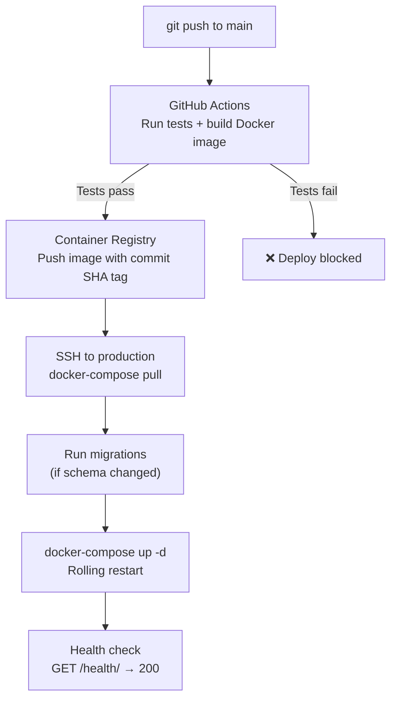

# Deployment Topology Diagrams

> Production infrastructure, request routing, and data flow.

---

## Production Stack

---

## Request Routing Detail

---

## Celery Task Categories

---

## Database Connection Flow

Without PgBouncer, 7 app processes × Django connection per request would quickly exhaust PostgreSQL's connection limit under load.

---

## Deployment Process

---

*Source: [architecture/deployment-topology.md](deployment-topology.md)*
