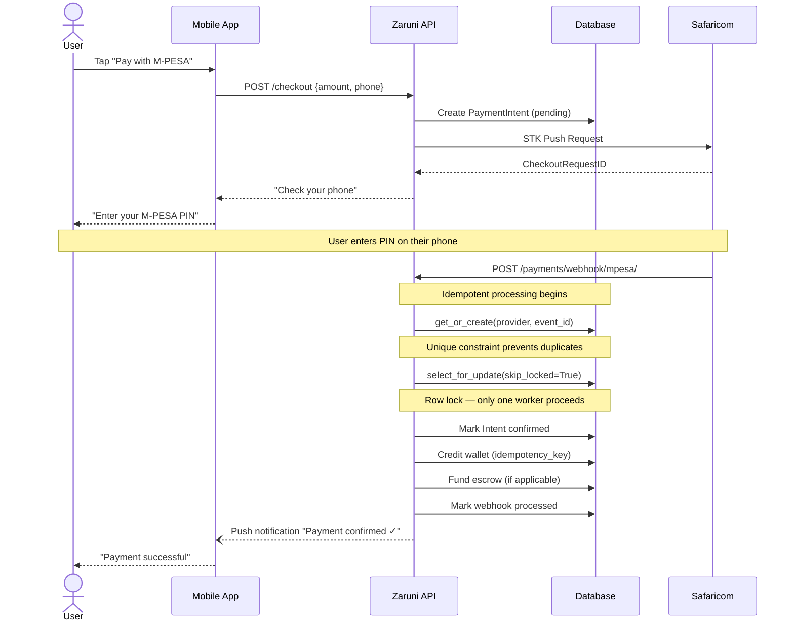
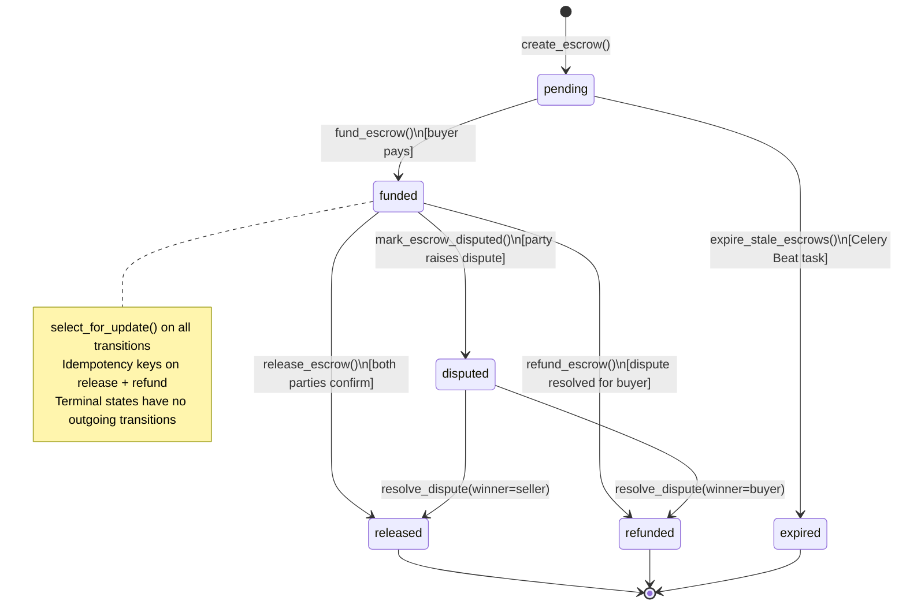
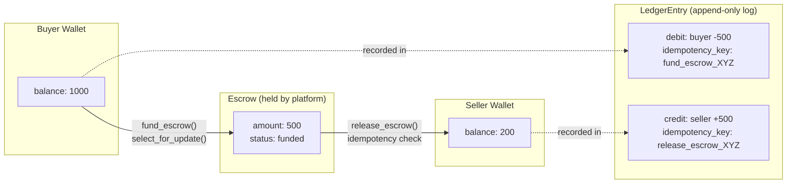
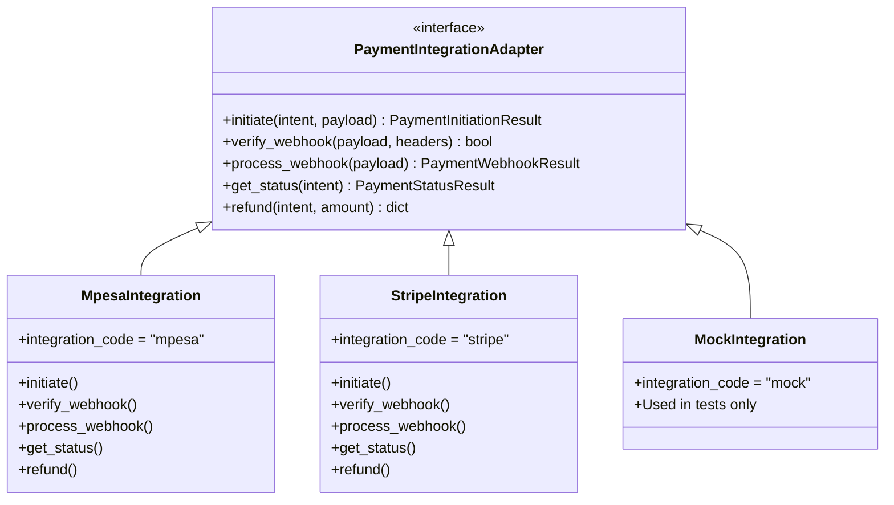

# Payments Flow Diagrams

> STK Push flow, escrow lifecycle, and wallet ledger.

---

## M-PESA STK Push — Full Payment Flow

---

## Escrow Lifecycle

---

## Wallet Ledger — Double-Entry Flow

---

## Payment Integration Architecture

Adding a new payment method = implementing this interface. Core payment flow unchanged.

---

*Source: [architecture/payments-architecture.md](payments-architecture.md) · [case-studies/2025-mpesa-idempotency.md](../case-studies/2025-mpesa-idempotency.md) · [case-studies/2025-escrow-design.md](../case-studies/2025-escrow-design.md)*
