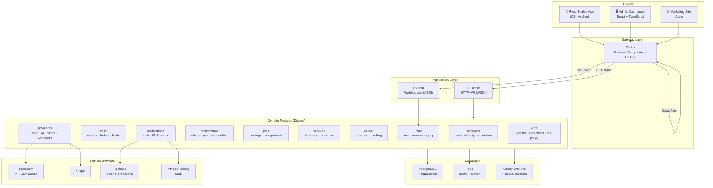
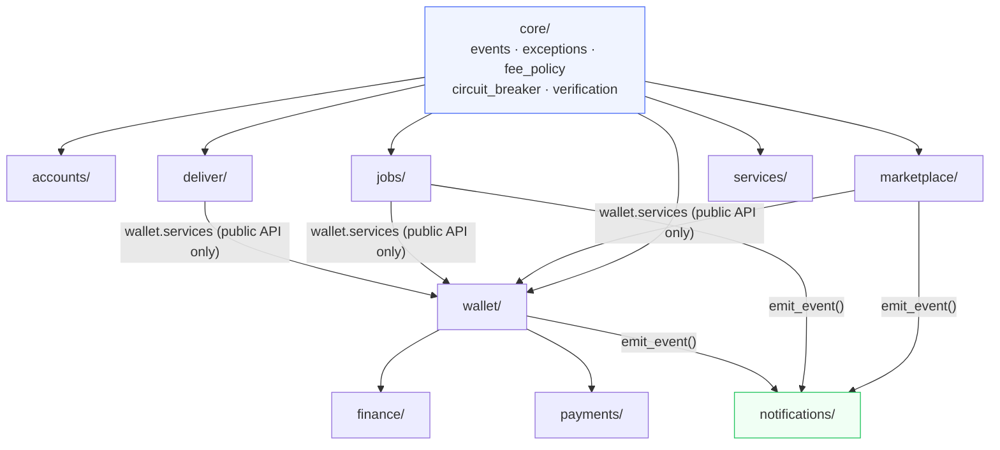

# Zaruni System Overview Diagram

> Full system architecture — clients, gateway, services, and data layer.

---

## Module Dependency Rules

**Rules:**
- `core` is a shared kernel — imported by everyone, imports from no one
- Cross-domain calls go through public service APIs, never internal utilities
- `notifications` is never imported directly — receives events only

---

*Source: [architecture/system-overview.md](system-overview.md)*
